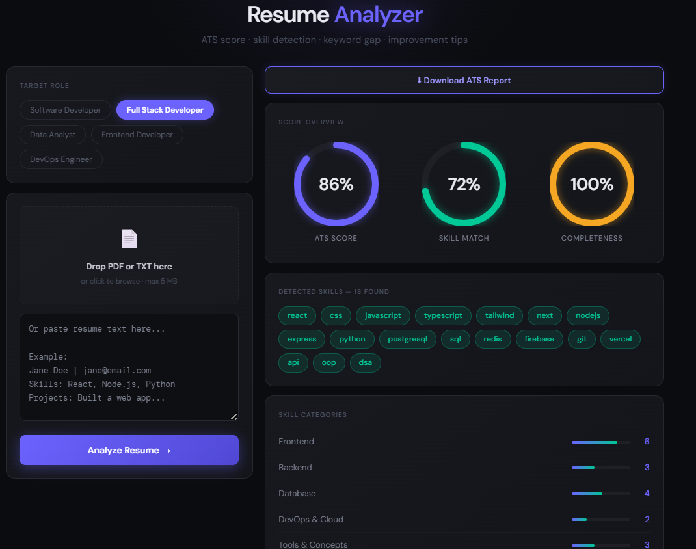
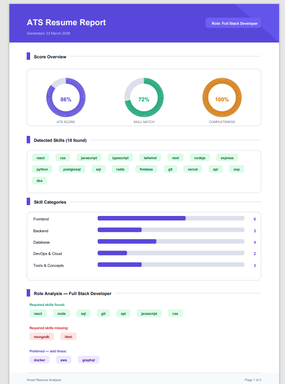

# 📄 Smart Resume Analyzer


> An NLP-based resume evaluation system that simulates real-world ATS (Applicant Tracking Systems) — built with React and Node.js.

🔗 **Live Demo:** [smart-resume-analyzer-one.vercel.app](https://smart-resume-analyzer-one.vercel.app)

---

## Screenshots

### Analyzer Dashboard


### ATS PDF Report


### Full Report View


---

## What It Does

Upload your resume or paste the text — the system instantly evaluates it the way real company ATS software does. It tells you your ATS compatibility score, which skills are detected, what's missing for your target role, and exactly how to improve. Download the full analysis as a professional PDF report.

---

## Features

- **ATS Score** — weighted scoring model (skills 50% + projects 20% + experience 20% + completeness 10%)
- **Skill Detection** — keyword extraction across 6 technical categories
- **Synonym Normalization** — detects "PostgreSQL" as SQL, "Data Structures and Algorithms" as DSA, "Node.js" as Node, and more
- **Role-Based Gap Analysis** — compares your resume against 5 job profiles
- **Section Completeness Check** — contact, education, experience, projects, skills, achievements
- **Smart Suggestions** — personalized tips based on what's actually missing
- **PDF + TXT Upload** — drag & drop or browse
- **Download ATS Report** — export full analysis as a professional light-theme PDF
- **Clean Dark UI** — 2-column layout with animated score rings

---

## Target Roles Supported

| Role | Required Skills Checked |
|------|------------------------|
| Software Developer | Python, JavaScript, Git, SQL, API, REST, OOP, DSA |
| Full Stack Developer | React, Node, MongoDB, SQL, Git, API, HTML, CSS |
| Data Analyst | Python, SQL, Pandas, NumPy, Excel, Tableau, ML |
| Frontend Developer | React, JavaScript, HTML, CSS, TypeScript, Git |
| DevOps Engineer | Docker, Kubernetes, AWS, Git, Linux, CI/CD |

---

## ADS Pipeline

```
Input (resume text / PDF)
        ↓
normalizeText()       →  synonym mapping, variant handling
        ↓
extractSkills()       →  keyword matching across 6 categories
        ↓
checkSections()       →  detect contact / education / projects etc.
        ↓
matchRole()           →  required + preferred keyword gap analysis
        ↓
calcAtsScore()        →  weighted scoring formula
        ↓
generateSuggestions() →  context-aware, skill-specific feedback
        ↓
Output (JSON → React dashboard + downloadable PDF report)
```

---

## Tech Stack

| Layer | Technology |
|-------|-----------|
| Frontend | React 18, Vite |
| Backend | Node.js, Express |
| PDF Generation | jsPDF |
| PDF Parsing | pdf2json |
| File Upload | Multer |
| Deployment (Frontend) | Vercel |
| Deployment (Backend) | Render |

---

## Project Structure

```
resume-analyzer/
│
├── client/                   ← React + Vite frontend
│   ├── src/
│   │   ├── App.jsx           ← main UI (2-column layout, score rings)
│   │   ├── api.js            ← backend communication
│   │   ├── Generatepdf.jsx   ← professional PDF report generator
│   │   ├── main.jsx
│   │   └── styles.css
│   ├── index.html
│   └── package.json
│
├── server/                   ← Node.js + Express backend
│   ├── index.js              ← Express server + routes
│   ├── analyzer.js           ← NLP logic (normalize, extract, score)
│   ├── skills.json           ← skills database + job roles
│   └── package.json
│
└── screenshot/               ← Project screenshots
    ├── ats.png
    ├── atspdf.png
    └── rest report.png
```

---

## Local Setup

### 1. Clone the repo
```bash
git clone https://github.com/NainaKothari-14/Smart-Resume-Analyzer.git
cd Smart-Resume-Analyzer
```

### 2. Start the backend
```bash
cd server
npm install
npm run dev
# runs on http://localhost:5000
```

### 3. Start the frontend
```bash
cd client
npm install
npm run dev
# runs on http://localhost:5173
```

### 4. Environment variables

Create `client/.env.development`:
```
VITE_API_URL=http://localhost:5000/api
```

---

## API Endpoints

| Method | Route | Description |
|--------|-------|-------------|
| GET | `/api/health` | Server health check |
| GET | `/api/roles` | Get all job roles |
| POST | `/api/analyze` | Analyze pasted text |
| POST | `/api/upload` | Analyze PDF or TXT file |
